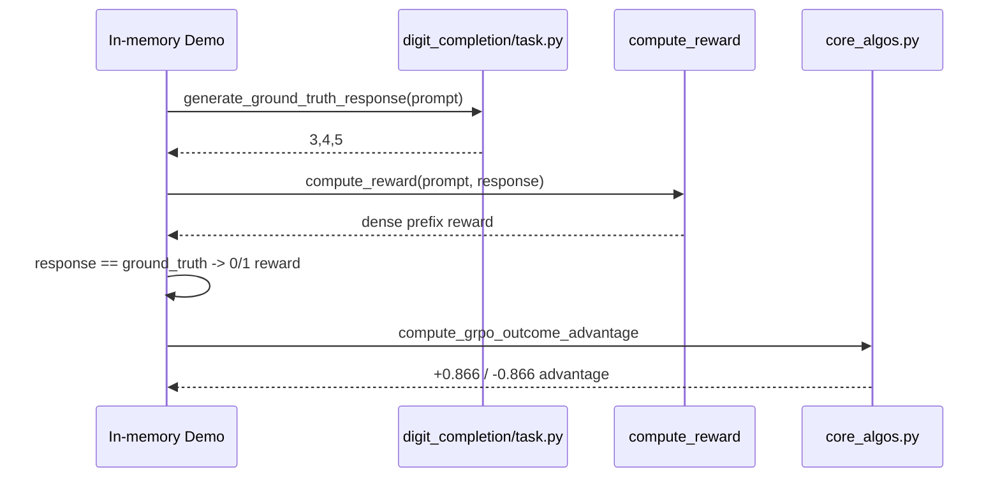
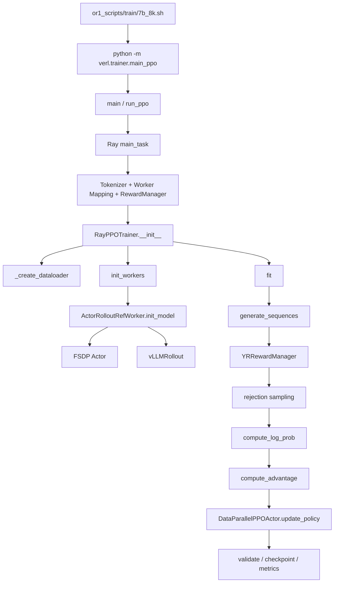

# Skywork-OR1 Execution Trace

## 1. 本轮实际跑通的最小闭环

选择仓库自带的 digit-completion 任务，因为它有明确 prompt、标准答案和 verifier，不需要下载大模型。

### 1.1 输入

```text
prompt = 1,2:6,3
```

解释：前两个数是 1、2；模数是 6；继续生成 3 个数。

### 1.2 调用链



### 1.3 实际结果

两组 prompt，每组四条回答，reward 都是 `[1, 0, 0, 1]`。仓库函数输出每组：

```text
[+0.8660, -0.8660, -0.8660, +0.8660]
```

这验证了 `verifier -> group reward -> GRPO advantage` 的最小闭环。

## 2. 生产训练主链路



## 3. 逐步数据结构变化

### 步骤 1：`RLHFDataset.__getitem__`

输入行包含 `prompt`、`reward_model`、`ability`、`extra_info`。输出：

```text
input_ids:       [prompt_len]
attention_mask:  [prompt_len]
position_ids:    [prompt_len]
non-tensor:      ground_truth / data_source / ability / extra_info
```

### 步骤 2：`DataProto.from_single_dict`

张量进入 `TensorDict`；Python 对象进入 `non_tensor_batch`；控制信息进入 `meta_info`。

### 步骤 3：`RayPPOTrainer.fit`

`gen_batch` 只保留生成需要的三个张量，并按 `rollout.n` 重复。

### 步骤 4：`ActorRolloutRefWorker.generate_sequences`

调用 `vLLMRollout.generate_sequences` 后新增：

```text
prompts:        [B*n, prompt_len]
responses:      [B*n, response_len]
input_ids:      [B*n, prompt_len + response_len]
attention_mask: [B*n, total_len]
position_ids:   [B*n, total_len]
```

### 步骤 5：UID 分组

每个原始 prompt 生成一个 UUID，随后 interleave 重复，使同题的 n 条回答共享 UID。

### 步骤 6：`YRRewardManager.__call__`

decode response，选择 math/code ground truth，多进程调用 verifier。输出 `token_level_scores [B*n, response_len]`，通常只在最后一个有效 token 写分数。

### 步骤 7：rejection sampling

按 UID 汇总 sequence reward，过滤全 0 或全 1 的组；再向下取整到 world size 的倍数。

### 步骤 8：重新计算概率

`ActorRolloutRefWorker.compute_log_prob` 调 `DataParallelPPOActor.compute_log_prob`，新增 `old_log_probs`。可选 reference policy 新增 `ref_log_prob`。

### 步骤 9：GRPO advantage

`compute_advantage -> compute_grpo_outcome_advantage`，新增 `advantages` 和 `returns`。

### 步骤 10：策略更新

`ActorRolloutRefWorker.update_actor -> DataParallelPPOActor.update_policy`：

```text
forward -> new log_prob + entropy
-> PPO clipped loss
-> optional entropy/KL term
-> backward -> grad clip -> optimizer.step
```

## 4. 输出在哪里生成

- checkpoint：`trainer.default_local_dir/global_step_*/actor`。
- 训练统计：`trainer.stats_path` 下 JSONL/统计文件。
- 评测生成：`data.output_path` 指定的 pkl。
- 聚合指标：输出目录下 `pass.csv`。
- 控制台/WandB：`Tracking.log`。

## 5. 适合断点和日志的位置

| 位置 | 建议观察 |
|---|---|
| `RLHFDataset.__getitem__` | chat template、prompt 长度、ground truth |
| `RayPPOTrainer.fit` 进入 batch 后 | batch keys、shape、UID |
| `generate_sequences` 后 | response 长度、EOS、重复顺序 |
| `YRRewardManager.__call__` | decode 文本、data_source、score |
| rejection sampling 后 | 全对/全错比例、有效 batch 大小 |
| `compute_grpo_outcome_advantage` | 每组 reward、mean、std、advantage |
| `compute_policy_loss` | ratio、clip fraction、KL |
| `DataParallelPPOActor.update_policy` | entropy、loss、grad norm |
| `_save_checkpoint` | global step、实际路径 |

## 6. Profiler 建议

- Driver：已有 `_timer('gen'/'old_log_prob'/'update_actor')`，先看阶段耗时。
- GPU：在 worker 内用 `torch.profiler` 包住 `_forward_micro_batch` 或 `update_policy`。
- vLLM：看 KV cache、max batched tokens、GPU memory utilization。
- Verifier：记录每类 data_source 的耗时、超时率和异常率。
- 分布式：看每个 DP rank 的 token 数，验证 `_balance_batch` 是否有效。

## 7. 当前机器能执行的命令

```powershell
$env:PYTEST_DISABLE_PLUGIN_AUTOLOAD='1'
venv\Scripts\python -m pytest -q tests\sanity\test_import.py
venv\Scripts\python -m pytest -q tests\utility\test_tensor_dict_utilities.py
venv\Scripts\python -m verl.trainer.main_ppo --help
```

完整训练入口：

```bash
export CODE_PATH=/workspace/Skywork-OR1
export MODEL_PATH=deepseek-ai/DeepSeek-R1-Distill-Qwen-7B
bash or1_scripts/train/7b_8k.sh
```

当前 RTX 4060 8GB 无法运行官方 7B 多卡长 CoT 配置；上面的完整命令应在 Linux 多卡环境执行。
