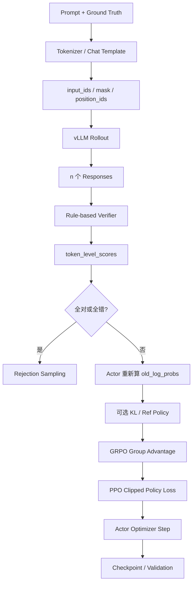

# Skywork-OR1 First Principles

## 1. 从底层问题开始

一个语言模型只会根据当前参数分布采样 token。要让它“更会推理”，系统至少要回答三个问题：

1. 哪些问题值得训练？
2. 一条生成结果到底好不好？
3. 如何提高好结果的概率，同时避免模型训练崩掉？

Skywork-OR1 的答案是：选择可验证且难度适中的数学/代码问题；同题采样多条回答；用 verifier 自动判分；用 GRPO 得到相对 advantage；用 PPO 风格 loss 更新策略。

## 2. 输入、输出和中间状态

### 输入

- prompt：聊天消息列表，例如数学题或代码题。
- ground truth：数学答案或代码测试用例。
- policy checkpoint：DeepSeek-R1-Distill-Qwen-7B/32B 等。
- 配置：上下文长度、group size、batch size、temperature、并行度等。

### 输出

- 更新后的模型 checkpoint。
- 每步训练指标：reward、entropy、KL、clip fraction、长度、吞吐等。
- 验证样本和 `pass.csv`。
- AIME Avg@32、LiveCodeBench Avg@4 等结果。

### 中间状态

核心状态都装在 `DataProto`：

- 张量：`prompts`、`responses`、`input_ids`、`attention_mask`、`position_ids`。
- 概率：`old_log_probs`、可选 `ref_log_prob`。
- 信号：`token_level_scores`、`token_level_rewards`、`advantages`、`returns`。
- 非张量：`uid`、`data_source`、`ability`、`reward_model`、`extra_info`。
- 元信息：temperature、micro batch、max token length、entropy controller。

## 3. 数据流图



## 4. 最稀缺的资源

### 4.1 GPU 显存

长 CoT 同时放大参数、激活、KV cache、logits 和优化器状态。代码用 FSDP、CPU offload、gradient checkpointing、remove-padding、sequence parallel 缓解。

### 4.2 Rollout 计算预算

每个 prompt 采样 `n` 条回答，响应可达 8K/16K/32K token。成本近似随 `prompt 数 × group size × response length` 增长，因此 rollout 通常是最贵阶段。

### 4.3 高质量、可验证且有区分度的数据

全对和全错的问题都缺少 GRPO 相对信号。数据质量不只是“答案正确”，还包括 verifier 可靠和难度适配当前模型。

### 4.4 策略的探索能力

entropy 不是硬件资源，但训练中同样稀缺。过早熵塌陷后，模型生成趋同，新的有效轨迹减少。

## 5. 核心抽象

- `DataProto`：跨函数、跨进程、跨 worker 的统一数据协议。
- `Role`/`ResourcePoolManager`：把 actor、critic、ref、reward model 映射到 GPU 资源池。
- `RayWorkerGroup`：把远程 worker 伪装成可调用的方法集合。
- `ActorRolloutRefWorker`：管理训练模型、生成引擎和可选参考策略。
- `RewardManager`：把文本输出转换为 token-level reward tensor。
- `Hydra Config`：同一套代码切换 7B/32B、上下文长度和并行策略。

## 6. 系统中最贵的一步

最贵的是长序列、多样本 rollout。理由：

- 每个 prompt 生成 16 或更多 response。
- 每条 response 可到数万 token。
- 生成是自回归的，必须逐 token 前进。
- 随后还要重新计算 actor logprob。

这解释了为什么项目引入 vLLM、KV cache 管理、chunked prefill、多阶段上下文和动态 batch。

## 7. 正确性如何验证

### 任务正确性

- 数学：`math_verify_reward_function` 先字符串匹配，再符号等价判断。
- 代码：AST 语法检查、输入输出测试、函数单测或 assert case。

### 数据正确性

- `DataProto.check_consistency` 检查 batch 对齐和 object array。
- `RayPPOTrainer._validate_config` 检查 batch、GPU、micro batch、sequence parallel 约束。

### 算法正确性

- `tests/utility/test_tensor_dict_utilities.py` 验证数据协议操作。
- `tests/gpu_utility/` 验证 logprob、mask 和 scheduler。
- `tests/e2e/` 验证端到端 reward 学习。

### 研究正确性

- AIME/LiveCodeBench 多次采样。
- 论文 ablation 区分数据、temperature、entropy、KL、多阶段训练的贡献。

## 8. 性能如何衡量

### 模型效果

- Avg@K：K 次采样的平均正确率。
- Pass@K：K 次至少一次正确的比例。
- 数据源分组 reward。

### 训练效率

- rollout、old logprob、actor update、validation 各阶段耗时。
- 每步有效 token 数、响应长度、截断比例。
- MFU、GPU memory utilization、动态 batch token 上限。

### 训练健康度

- entropy、entropy coefficient。
- KL、PPO clip fraction。
- 全错/全对 prompt 比例。
- reward 分布和 advantage 分布。

## 9. GRPO 的第一性原理

同一个 prompt 的 M 条回答得到标量奖励 `r_i`：

```text
A_i = (r_i - mean(r_1...r_M)) / (std(r_1...r_M) + epsilon)
```

含义不是“回答绝对有多好”，而是“它相对同题其他回答有多好”。这用组内统计替代了 critic baseline。

仓库实现：`verl/trainer/ppo/core_algos.py::compute_grpo_outcome_advantage`。

## 10. PPO clipping 的第一性原理

策略更新后，新旧概率比为：

```text
ratio = exp(new_log_prob - old_log_prob)
```

若优势为正，希望 ratio 增大；优势为负，希望 ratio 减小。但无限变化会使策略崩溃，所以目标取未裁剪项和裁剪项中更保守的一个。

仓库实现：`core_algos.compute_policy_loss`。

## 11. 如果从零实现最小版本

必须保留：

1. prompt + ground truth 数据集。
2. tokenizer 和可生成的 policy model。
3. rollout：同题采样 M 条 response。
4. verifier：response -> scalar reward。
5. group id：标识同一 prompt 的回答组。
6. GRPO advantage。
7. actor logprob 和 PPO clipped loss。
8. optimizer、checkpoint、基本评测。

第一版可以删除：Ray、FSDP、vLLM、reference policy、critic、WandB、HDFS、Megatron。它们解决的是规模和效率，不是算法闭环成立的必要条件。

## 12. 设计中的隐含假设

- verifier 的错误率足够低，否则会出现 reward hacking。
- 同一 prompt 的多条 rollout 有足够差异。
- batch 在 rejection sampling 后仍大到可被 world size 整除。
- response 至少有一个有效 token；否则 `valid_response_length - 1` 会落到 `-1`。
- 代码 sandbox 在 Linux 上运行；`signal.SIGALRM` 不适用于 Windows。
- FSDP 权重能被 sharding manager 正确同步到 vLLM。
