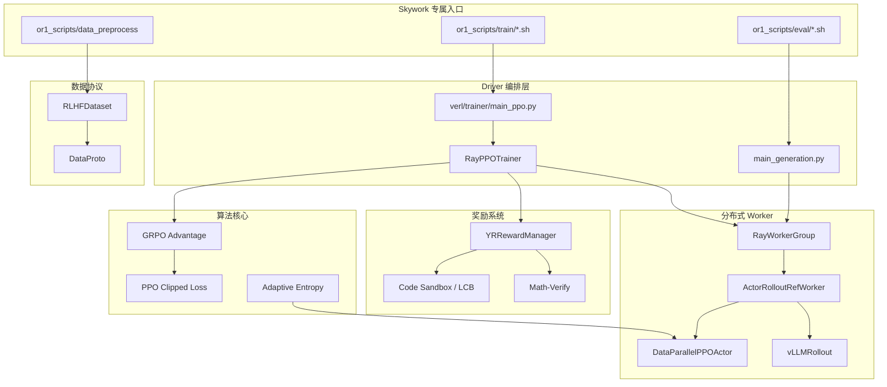
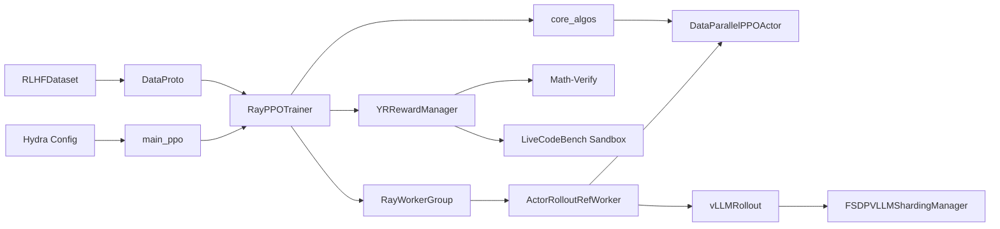

# Skywork-OR1 Repository Map

> 基线：本地 `main`，提交 `5aaf786`；分析日期：2026-07-13。

## 1. 项目解决的核心问题

Skywork-OR1 解决的是：如何在已经具备长思维链能力的语言模型上，用数学/代码任务的可验证奖励继续做大规模强化学习，使模型在 AIME 和 LiveCodeBench 上更准确、更稳定。

它不是多模态仓库。它的技术价值集中在 LLM 后训练：RLVR、GRPO/PPO、规则验证器、长 CoT rollout、Ray 分布式调度、FSDP 参数分片和 vLLM 推理加速。

## 2. 技术领域和应用场景

- 领域：大语言模型后训练、强化学习、分布式训练、推理加速。
- 任务：数学推理、代码生成、长链路 CoT。
- 场景：训练 reasoning model、设计可验证奖励、评测多次采样稳定性。
- 可迁移方向：视觉数学、图表问答、OCR 推理、多模态 agent 等可构造 verifier 的任务。

## 3. 项目架构图

## 4. 主要目录和职责

| 路径 | 职责 | 阅读优先级 |
|---|---|---|
| `or1_scripts/` | Skywork 数据准备、7B/32B 训练和评测命令 | 最高 |
| `or1_data/` | AIME24/25 验证数据；训练数据运行脚本后生成 | 高 |
| `verl/trainer/` | Hydra 入口、PPO/GRPO 编排、SFT/评测 | 最高 |
| `verl/workers/` | Actor、Critic、rollout、reward、FSDP/Megatron worker | 最高 |
| `verl/utils/` | 数据集、张量工具、verifier、日志、并行辅助 | 高 |
| `verl/protocol.py` | 分布式函数间交换数据的 `DataProto` 协议 | 最高 |
| `verl/single_controller/` | Ray worker 创建、注册、分发和 RPC | 中高 |
| `verl/models/` | 模型适配、remove-padding、Megatron Llama 实现 | 中 |
| `verl/third_party/vllm/` | vLLM 0.3.1/0.4.2/0.5.4/0.6.3 兼容层 | 暂缓 |
| `tests/` | sanity、DataProto、Ray、FSDP、rollout、sandbox、E2E | 高 |
| `examples/` | 通用 verl 的 PPO/SFT/ReMax/数据处理示例 | 中 |
| `docs/` | verl 文档和本项目中文学习材料 | 高 |
| `papers/` | Skywork-OR1 技术报告 PDF | 高 |
| `.github/workflows/` | CI 测试矩阵 | 低 |

## 5. 入口文件

### Skywork 主入口

- 数据：`or1_scripts/data_preprocess/download_and_filter_data_{1p5b,7b,32b}.py`
- 训练：`or1_scripts/train/{7b,32b}_{8k,16k,32k}.sh`
- 评测：`or1_scripts/eval/eval_7b.sh`、`eval_32b.sh`

### Python 主入口

- `verl/trainer/main_ppo.py::main`：PPO/GRPO 训练。
- `verl/trainer/main_generation.py::main`：离线多采样生成和评测。
- `verl/trainer/main_eval.py::main`：离线 reward 评估。
- `verl/trainer/fsdp_sft_trainer.py::main`：SFT。

### 最小测试入口

- `tests/e2e/arithmetic_sequence/rl/main_trainer.py::main`
- `tests/e2e/envs/digit_completion/task.py`
- `tests/sanity/test_import.py`
- `tests/utility/test_tensor_dict_utilities.py`

## 6. 关键依赖

| 依赖 | 作用 | 实际约束 |
|---|---|---|
| PyTorch | 模型训练、FSDP、张量计算 | README 指定 2.4.0/CUDA 12.4 |
| Ray >= 2.38 | Worker 调度和 RPC | Windows 可导入，训练仍依赖 CUDA/Linux |
| TensorDict < 0.6 | `DataProto.batch` 的底层容器 | 与 PyTorch 版本必须匹配 |
| Transformers < 4.48 | 模型、tokenizer、chat template | 本轮固定 4.47.1 |
| vLLM == 0.6.3 | 高吞吐 rollout | Linux/CUDA 专属 |
| flash-attn | remove-padding 和高效注意力 | Linux/CUDA 编译依赖 |
| Hydra/OmegaConf | 配置组合和命令行覆盖 | `ppo_trainer.yaml` 是默认配置 |
| math-verify | 数学答案解析与等价判断 | verifier 核心 |
| pandas/pyarrow/datasets | pkl/parquet/Hugging Face 数据 | 数据层 |
| wandb | 训练与验证指标 | 可选远端日志 |

实践环境比 `pyproject.toml` 的 `Python >= 3.8` 更严格：`pyext` 在 Python 3.12 使用已删除的 `inspect.getargspec`，官方 README 的 Python 3.10 更可信。

## 7. 配置文件

- `verl/trainer/config/ppo_trainer.yaml`：PPO/GRPO 默认配置。
- `verl/trainer/config/generation.yaml`：离线生成配置。
- `verl/trainer/config/evaluation.yaml`：离线评估配置。
- `verl/trainer/config/sft_trainer.yaml`：SFT 配置。
- `verl/trainer/config/ppo_megatron_trainer.yaml`：Megatron 后端。
- `or1_scripts/train/*.sh`：通过 Hydra `key=value` 覆盖默认配置。
- `pyproject.toml`、`setup.py`、`requirements.txt`：包与依赖。
- `docker/*`：官方训练镜像构建参考。

## 8. 测试、示例和文档入口

- 数据协议：`tests/utility/test_tensor_dict_utilities.py`
- GPU 工具：`tests/gpu_utility/`
- Ray：`tests/ray/`
- vLLM rollout：`tests/rollout/`
- 代码 sandbox：`tests/sandbox/test_sandbox.py`
- 数据集：`tests/verl/utils/dataset/`
- 端到端：`tests/e2e/`
- 最小 tiny model：`tests/e2e/arithmetic_sequence/`
- 通用例子：`examples/ppo_trainer/`、`examples/sft/`、`examples/data_preprocess/`
- 项目说明：`README.md`
- 论文：`papers/2505.22312.pdf`
- 中文总纲：`docs/Skywork-OR1_项目学习总纲.md`
- 三层题库：`docs/Skywork-OR1_三层面试题库.md`

## 9. 核心模块依赖图

## 10. 推荐阅读顺序

1. `README.md`：只建立背景和命令印象。
2. `or1_scripts/train/7b_8k.sh`：先看项目真实参数。
3. `verl/trainer/config/ppo_trainer.yaml`：分清默认值与覆盖值。
4. `verl/trainer/main_ppo.py`：看对象如何装配。
5. `verl/utils/dataset/rl_dataset.py` + `verl/protocol.py`：先懂数据形状。
6. `verl/trainer/ppo/ray_trainer.py::fit`：追主链路。
7. `verl/workers/reward_manager/yr_code.py` + `compute_score.py`：懂 reward。
8. `verl/trainer/ppo/core_algos.py`：懂 GRPO/PPO 数学。
9. `verl/workers/actor/dp_actor.py::update_policy`：看 loss 如何反传。
10. `verl/workers/fsdp_workers.py` + `vllm_rollout.py`：看训练/推理切换。
11. `verl/trainer/main_generation.py`：看评测输出。
12. `tests/e2e/arithmetic_sequence/`：用 tiny 任务复盘闭环。

## 11. 暂时可以跳过

- `verl/third_party/vllm/vllm_v_*`：多版本兼容实现，首轮不读。
- `verl/models/llama/megatron/`：除非岗位重点问 Megatron。
- `verl/workers/megatron_workers.py`：先掌握 FSDP 路线。
- `verl/utils/reward_score/livecodebench/lcb_runner/runner/*`：第三方 API runner 与主训练无关。
- 大部分 `.github/workflows/`、Sphinx 文档构建文件。
- 与 Skywork 配方无直接关系的通用 SFT/ReMax 示例。
