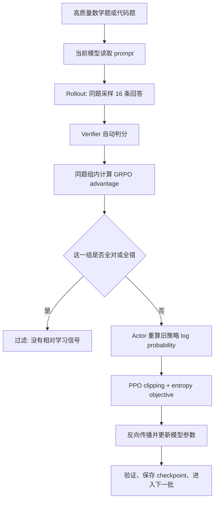
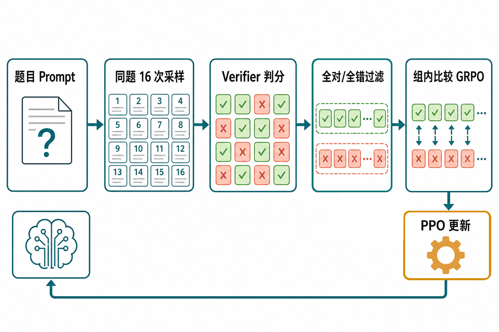
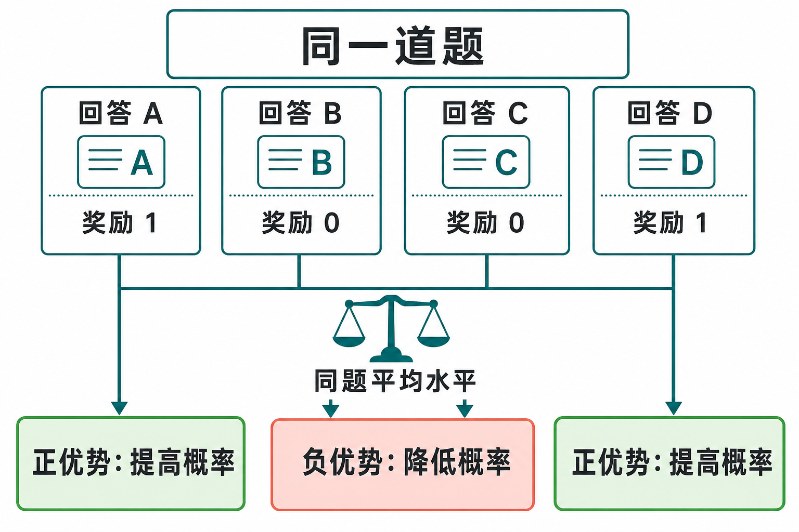
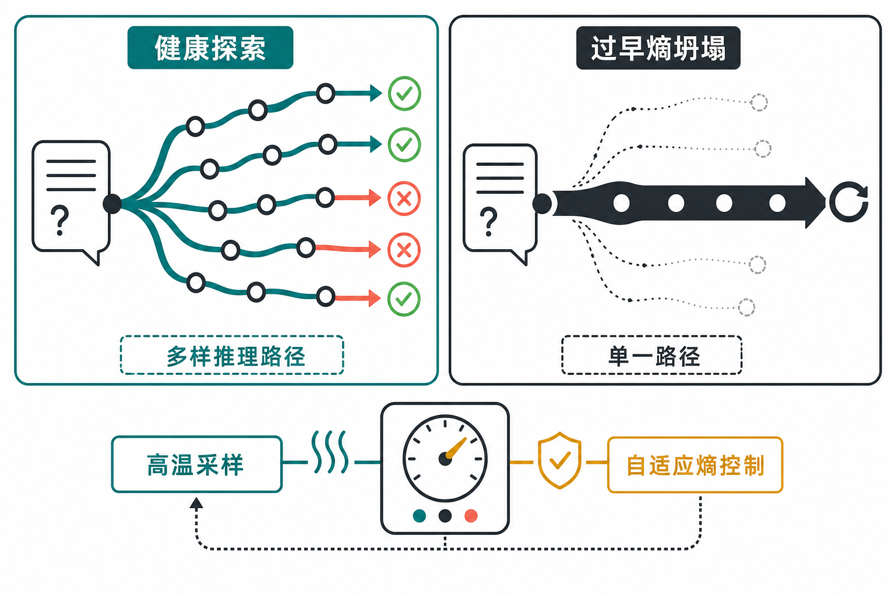
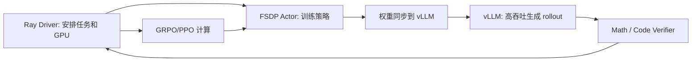
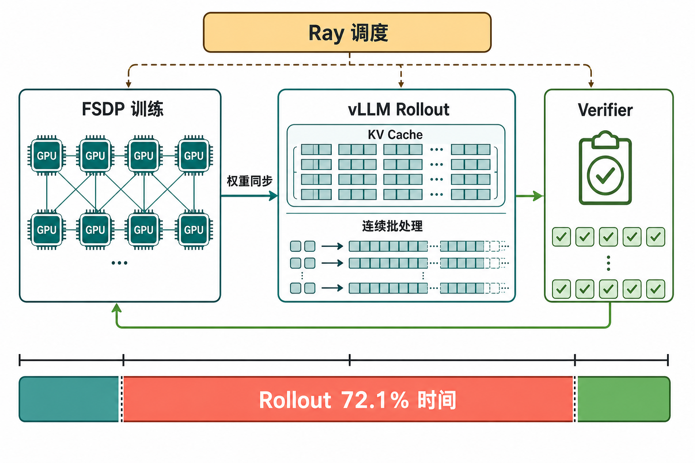
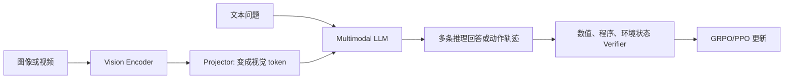
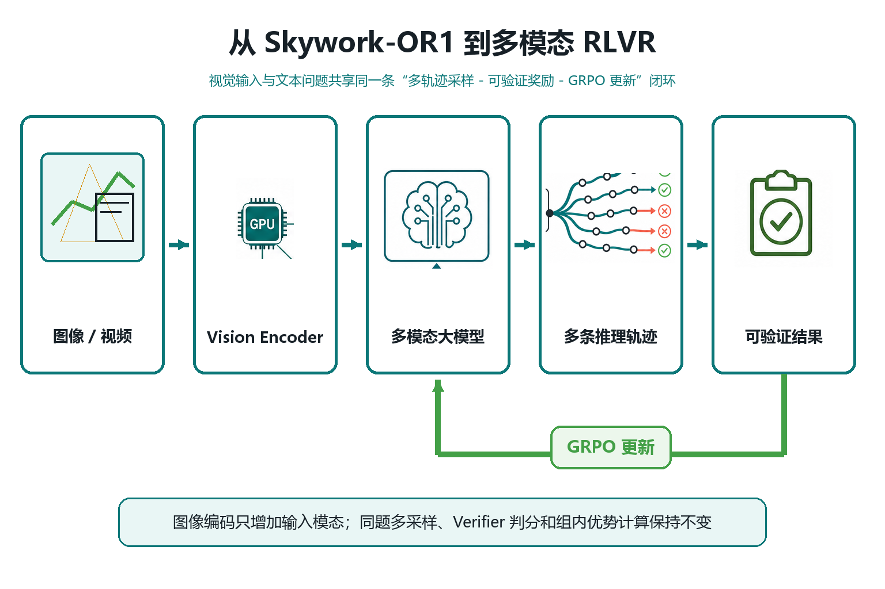

# Skywork-OR1 原理精讲与李环老师面试准备

> 面向第一次系统学习大模型强化学习的读者。更新时间：2026-07-15。
>
> 这不是代码目录说明，而是一份“从一道题如何变成一次模型更新”出发的原理讲义。文中的项目结论来自本地技术报告 `papers/2505.22312.pdf` 和当前源码；对李环老师面试重点的判断来自浙江大学教师主页与个人主页公开研究方向，只能视为有依据的预测，不能视为老师本人给出的题目。

## 0. 明天面试前，先记住这段话

Skywork-OR1 不是一个新的 Transformer 结构，也不是多模态模型。它解决的问题是：已经会写长推理过程的语言模型，怎样通过数学题和代码题的自动判分结果继续训练，从而更稳定地得到正确答案。

它的基本做法很像训练一个参加数学竞赛的学生。对同一道题，先让学生独立尝试多次；再由一个可靠的判卷器判断每次答案是否正确；然后比较同一道题下哪些尝试优于平均水平；最后提高这些较好推理路径出现的概率，降低较差路径出现的概率。为了防止学生过早只会一种固定套路，训练还会维持一定的随机性和探索能力。

用专业语言说，这叫 **RLVR（Reinforcement Learning with Verifiable Rewards，可验证奖励强化学习）**。Skywork-OR1 以 DeepSeek-R1-Distill-Qwen-7B/32B 为起点，采用经过修改的 GRPO/PPO 训练方法，在数学和代码任务上使用规则验证器产生奖励，并通过高质量数据、分阶段上下文训练、高温采样、自适应熵控制和 on-policy 更新保持训练效率与探索能力。论文把这套配方称为 **MAGIC**。

你在面试中最稳妥的项目定位是：

> 我把 Skywork-OR1 理解为一个面向长思维链模型的 RLVR 后训练系统。它的研究重点不是修改模型结构，而是围绕数据质量、组内相对优势、策略更新稳定性、探索能力和 rollout 效率，设计一套可扩展的训练配方。这个仓库本身不是多模态项目，但它使用的 verifier、GRPO 和高吞吐 rollout 思路可以迁移到有明确可验证答案的多模态任务。

## 1. 为什么不能只用监督微调

语言模型接收题目 $x$，然后一个 token 接一个 token 地生成回答 $y=(y_1,y_2,\ldots,y_T)$。token 可以理解为模型处理文本的基本单位，可能是一个汉字、一个英文词的一部分或一个符号。模型生成整段回答的概率是：

$$
p_\theta(y\mid x)=\prod_{t=1}^{T}p_\theta(y_t\mid x,y_{<t})
$$

这里的 $\theta$ 是模型参数，$y_{<t}$ 表示第 $t$ 个 token 之前的所有内容。这个公式的意思很简单：整段回答的概率，等于每一步生成当前 token 的条件概率相乘。

**SFT（Supervised Fine-Tuning，监督微调）** 给模型一批“题目—标准解答”，要求模型模仿标准解答。它通常最小化负对数似然：

$$
\mathcal L_{\text{SFT}}(\theta)
=-\sum_{t=1}^{T}\log p_\theta(y_t^*\mid x,y_{<t}^*)
$$

其中 $y^*$ 是人工或强模型提供的标准答案。SFT 的优点是稳定，缺点是它只能告诉模型“请像这份答案一样写”。同一道数学题可能有很多正确推理路径，SFT 只奖励数据里出现的那一条。只要某条生成和标准文字不同，即使最终答案正确，逐 token 模仿也可能把它当成偏离。

强化学习换了一个目标。它不要求回答逐字等于参考解答，而是关心最终结果有没有价值：

$$
J(\theta)=\mathbb E_{x\sim D,\;y\sim\pi_\theta(\cdot\mid x)}[r(x,y)]
$$

$D$ 是题目分布，$\pi_\theta$ 是当前语言模型策略，$r(x,y)$ 是奖励。数学题答对可得 1，答错得 0；代码通过全部单元测试得 1，否则得 0。训练目标是调整参数，使期望奖励 $J(\theta)$ 尽量大。

这就是 Skywork-OR1 的出发点：模型已经通过预训练和 SFT 学会语言、知识和长思维链；RL 不再教它逐字模仿，而是让它通过大量尝试，增加能通过验证器的推理路径的概率。

## 2. 把强化学习词汇翻译成大模型语言

经典强化学习常说 agent、state、action、trajectory、policy 和 reward。放到语言模型中，它们并不神秘。

| 术语 | 浅显解释 | 在 Skywork-OR1 中是什么 |
|---|---|---|
| Agent | 做决定的主体 | 正在训练的语言模型 |
| Policy $\pi_\theta$ | 在当前状态下如何选择动作 | 给定上下文后，下一个 token 的概率分布 |
| State $s_t$ | 做第 $t$ 次决定时已经知道的信息 | 题目加已经生成的前缀 |
| Action $a_t$ | 当前采取的动作 | 生成一个 token |
| Trajectory / Rollout | 从开始到结束的一整条尝试 | 一条完整的长思维链回答 |
| Reward | 对尝试结果的评价 | 数学等价判断或代码单测得到的分数 |
| Verifier | 自动判卷器 | Math-Verify 或 LiveCodeBench sandbox |
| Post-training | 预训练之后的能力和行为调整 | SFT、偏好优化、RLVR 都属于后训练 |
| CoT | Chain-of-Thought，思维链 | 模型在最终答案前生成的推理过程 |

最容易混淆的是 policy 和 model。这里二者通常指同一个网络，但强调角度不同。说 model 时关注神经网络结构；说 policy 时关注它给每个 token 分配概率并进行采样的行为。

## 3. 一道题如何走完整个训练流程

下面这张图是整个项目最需要记住的内容。面试时先讲清这条线，再根据追问展开公式和系统实现。





*全对和全错组在过滤阶段被移除，剩余同时包含正确与错误回答的组进入 GRPO；PPO 更新后的模型再生成下一轮 rollout。*

如果把上图压缩成不依赖任何框架的伪代码，核心只有下面几行：

```python
for prompts in dataset:
    responses = policy.generate(prompts, n=16, temperature=1.0)
    rewards = verifier(responses, ground_truth)       # 每条回答得到 0 或 1
    groups = keep_groups_with_both_0_and_1(rewards)   # 去掉全对和全错组
    old_logp = actor.log_prob(groups.responses)
    advantages = normalize_reward_within_each_prompt(groups)
    new_logp, entropy = actor.forward(groups.responses)
    loss = ppo_clipped_loss(old_logp, new_logp, advantages) \
           - adaptive_entropy_coefficient * entropy
    loss.backward()
    optimizer.step()
```

Ray、FSDP、vLLM 和 DataProto 都是在把这十行逻辑扩大到多机多卡、长上下文和大 batch；它们没有改变“生成—判分—比较—更新”的算法闭环。

先看一个最小例子。假设同一道题采样四条回答，验证器给出的奖励为：

$$
[1,0,0,1]
$$

两条答对、两条答错。GRPO 不直接把“1”当作统一大小的更新信号，而是把每条回答与同题其他回答比较。该组均值是 $0.5$。如果使用总体标准差 $0.5$，标准化后的相对优势就是：

$$
[1,-1,-1,1]
$$

正数表示比同题平均水平好，训练会提高这条回答中 token 的概率；负数表示低于平均水平，训练会降低这些 token 的概率。

本仓库 `compute_grpo_outcome_advantage` 使用 PyTorch 默认的样本标准差。四条数据的样本标准差约为 $0.577$，所以我们实际跑出的结果是：

$$
[+0.866,-0.866,-0.866,+0.866]
$$

这不是公式矛盾，而是总体标准差和样本标准差的定义不同。面试官如果追问具体数值，你能解释到这一层，会比只背 GRPO 公式更可信。



*同一道题下，A、D 的奖励为 1，得到正优势并提高生成概率；B、C 的奖励为 0，得到负优势并降低生成概率。*

如果奖励变成 $[1,1,1,1]$，四条答案都正确；如果变成 $[0,0,0,0]$，四条都错误。两种情况下，每条回答和组内平均值的差都是 0，因此没有相对优势。全对说明题太简单，全错说明题对当前模型太难或验证器有问题。Skywork-OR1 会过滤这类组，这就是训练阶段的 **rejection sampling（拒绝采样）**。这里的“拒绝”不是生成算法里为了得到某个分布而反复采样，而是把没有 GRPO 学习信号的 prompt 组从本次更新中移除。

源码中的实际顺序是：数据集给出 prompt 和标准答案；vLLM 为每个 prompt 生成多条回答；`YRRewardManager` 解码文本并调用数学或代码 verifier；trainer 按同一个 UID 聚合同题回答并过滤全对/全错组；actor 重新计算旧 log probability；`core_algos.py` 计算 GRPO advantage；`dp_actor.py` 计算 PPO loss、熵项并更新参数。你不需要背全部类名，但要能说出“采样—判分—组内比较—稳定更新”这四步。

## 4. GRPO 和 PPO 的数学原理

### 4.1 为什么提高正确答案概率能写成梯度

策略梯度的核心形式可以简化为：

$$
\nabla_\theta J(\theta)
=\mathbb E\left[r(x,y)\nabla_\theta\log\pi_\theta(y\mid x)\right]
$$

直觉是：如果一次采样奖励高，就沿着增大这条回答对数概率的方向更新；如果奖励低，就不要鼓励它。但直接使用奖励会有很大方差。例如，一道简单题的普通答案可能得 1，一道极难题中非常优秀但差最后一步的答案仍得 0。不同题目的难度不同，绝对奖励不可直接公平比较。

常见做法是减去 baseline（基线），得到 advantage（优势）：

$$
A=r-b
$$

advantage 回答的是“这次动作比预期好多少”，而不是“它绝对得了多少分”。PPO 通常训练一个 critic/value model 估计 baseline。GRPO 不训练单独的 critic，而是让同一道题的多条回答互相充当参照。

### 4.2 GRPO 的组内相对优势

对 prompt $x_i$ 采样 $M$ 条回答 $y_{i1},\ldots,y_{iM}$，奖励为 $r_{i1},\ldots,r_{iM}$。GRPO 使用：

$$
A_{ij}=\frac{r_{ij}-\mu_i}{\sigma_i+\epsilon}
$$

其中

$$
\mu_i=\frac{1}{M}\sum_{j=1}^{M}r_{ij}
$$

$\sigma_i$ 是组内标准差，$\epsilon$ 是防止除零的小常数。对一条回答来说，$A_{ij}$ 是一个序列级标量。仓库将它复制到该回答的全部有效 token 上，使正确回答中的整条生成路径都受到鼓励，错误回答中的整条路径都受到抑制。

GRPO 省掉 critic，减少了模型、显存和训练复杂度，但代价是每道题必须采样多条回答，而且组内必须有足够多样性。只采样一条时，没有“同题平均水平”，也无法稳定估计组内标准差。这就是为什么 `GROUP_SIZE=16` 不是普通的 batch 参数，而是算法成立的重要条件。

### 4.3 为什么还需要 PPO clipping

有了 advantage 后，不能直接大幅提高正样本概率。模型一次更新太猛，可能只记住少数高奖励路径，语言能力和输出分布也可能突然改变。PPO 比较新旧策略对同一个 token 的概率：

$$
\rho_t(\theta)
=\frac{\pi_\theta(a_t\mid s_t)}{\pi_{\text{old}}(a_t\mid s_t)}
=\exp\left(\log\pi_\theta-\log\pi_{\text{old}}\right)
$$

当 $\rho=1$ 时，新旧概率相同。若正 advantage 样本的旧概率是 0.10，新概率变成 0.16，则 $\rho=1.6$。假设 clip range $\varepsilon=0.2$，PPO 只按最多 1.2 的比例计算这次收益，超出的变化不再带来额外好处：

$$
\min\left(\rho_t A_t,
\operatorname{clip}(\rho_t,1-\varepsilon,1+\varepsilon)A_t\right)
$$

对负 advantage 也一样：模型可以降低错误路径概率，但不鼓励一步降得过猛。PPO clipping 像“每次只允许拧一点方向盘”，保证更新在旧策略附近逐步发生。

一个高频追问是：既然 vLLM 生成时已经有概率，为什么 actor 还要重算 `old_log_probs`？原因是 vLLM 是高吞吐推理引擎，actor 是训练模型。两者可能使用不同的权重布局、并行方式、数值精度和计算内核。PPO 的概率比必须建立在训练侧一致、可控的概率口径上，所以仓库让 actor 对已生成 token 再做一次 forward，得到可信的旧策略 log probability。

### 4.4 完整目标在优化什么

忽略工程细节后，Skywork-OR1 对每个有效 token 最大化下面的目标：

$$
\mathcal J(\theta)
=\mathbb E_{\text{token}}
\left[
\min\left(\rho_t A_t,
\operatorname{clip}(\rho_t,1-\varepsilon,1+\varepsilon)A_t\right)
+\alpha_k H_t
\right]
$$

第一项利用 verifier 奖励，让正确路径概率上升、错误路径概率下降；第二项是 entropy bonus（熵奖励），防止策略过早变得过度确定。代码实现为最小化负的策略目标，因此在 `dp_actor.py` 中能看到 `policy_loss = pg_loss - entropy_term`。最大化目标和最小化负目标只是写法不同。

## 5. 熵、探索、On-policy 和 KL

### 5.1 熵坍塌是什么

模型在某一步对词表给出概率分布 $p_1,\ldots,p_V$。熵定义为：

$$
H(p)=-\sum_{v=1}^{V}p_v\log p_v
$$

若只有两个候选 token，概率为 $[0.5,0.5]$，熵约为 0.693，说明模型还在两种选择间探索。若概率为 $[0.99,0.01]$，熵约为 0.056，说明模型几乎只会选择第一种。

低熵不天然是坏事。模型最终学会正确答案时，本来就应该更确定。真正的问题是 **premature entropy collapse（过早熵坍塌）**：模型还没找到足够好的策略，就快速收缩到少数固定推理套路。随后同题多次采样会越来越相似，新的正确路径变少，GRPO 的有效组也减少，模型逐渐失去学习可塑性。



*图中左侧保留多条可行推理路径，右侧策略过早集中到单一路径；底部控制器表示高温采样与自适应熵共同维持探索下限。*

### 5.2 自适应熵控制

固定熵系数很难调。系数太小挡不住坍塌，太大又会让模型一直随机，甚至把概率分散到无意义 token 上。MAGIC 设定目标熵 $H_{\text{target}}$，根据当前熵动态调节系数：

$$
c_{k+1}=
\begin{cases}
c_k+\Delta,&H_k<H_{\text{target}}\\
c_k-\Delta,&H_k>H_{\text{target}}
\end{cases}
$$

$$
\alpha_k=c_k\cdot\mathbf 1[H_k\le H_{\text{target}}]
$$

当熵低于目标值时，加大鼓励探索的力度；当熵高于目标值时，减小系数并关闭不必要的熵项。论文报告的目标熵为 0.2。当前 7B 训练脚本把系数限制在 $[0,0.005]$，每次调整 $0.0001$。它类似恒温器：温度低于设定值才加热，而不是永远以同一功率加热。

### 5.3 On-policy 与 Off-policy

**On-policy（同策略数据）** 表示用于更新的数据由当前策略产生。**Off-policy（异策略数据）** 表示数据来自旧策略或其他策略。语言模型更新一次后，昨天采样的回答就不再严格来自今天的模型。

论文把一次 rollout 后执行的 SGD 次数写为：

$$
N_{\text{SGD}}
=\frac{D_R}{D_T}\times N_{\text{reuse}}
$$

$D_R$ 是 rollout prompt 数，$D_T$ 是每次更新使用的 prompt 数，$N_{\text{reuse}}$ 是同一批 rollout 被重复使用的次数。当三者满足 $D_R=D_T$、$N_{\text{reuse}}=1$ 时，一批新数据只做一次策略更新，最接近 on-policy。把一批数据切成多个 mini-batch 或反复复用，会使后面的更新面对越来越陈旧的数据。

Skywork 的消融实验发现，增加 $N_{\text{SGD}}$ 看起来能用同一批昂贵 rollout 多训练几次，却会加速熵坍塌并降低最终测试性能。关键矛盾是：数据复用提高了单批样本利用率，却扩大了生成策略和训练策略之间的分布偏差。对这个项目来说，on-policy 更慢、更耗采样，但长期性能更好。

### 5.4 PPO clipping 和 KL penalty 不是一回事

PPO clipping 限制“当前更新后的策略”不要离“生成这批 rollout 的旧策略”太远。KL penalty 则通常限制 actor 不要离一个固定 reference model 太远：

$$
D_{\mathrm{KL}}(\pi_\theta\|\pi_{\text{ref}})
=\mathbb E_{a\sim\pi_\theta}
\left[\log\frac{\pi_\theta(a\mid s)}{\pi_{\text{ref}}(a\mid s)}\right]
$$

KL 像一根绳子，把模型拴在初始模型附近，通常能保护语言质量并减少 reward hacking。但 Skywork-OR1 的实验发现，在后续阶段 KL 会把模型强行拉回 reference policy，使数学性能停止提升，所以最终配方把 KL 系数设为 0。

这不是“KL 永远没用”。如果 verifier 容易被钻漏洞、训练数据窄、模型出现语言退化，KL 可能仍然有价值。正确回答应是：Skywork 在这套高质量可验证任务和训练设置中通过消融选择 no-KL；换任务必须重新验证，不能把经验当定律。

## 6. MAGIC 到底做了什么

MAGIC 是 **Multi-stage Adaptive entropy scheduling for GRPO In Convergence** 的缩写。它不是一个单独的新 loss，而是一组围绕长 CoT 强化学习的配方。可以把它理解成五个相互配合的答案：训练什么题、如何采样、如何比较、如何稳定更新、如何降低长序列成本。

### 6.1 数据不是越多越好，而是要可验证、正确、难度合适

数学数据最初来自 NuminaMath-1.5 等来源，代码数据主要来自 LeetCode 和 TACO。团队先去重、清理格式、排除需要图片或外部链接的题目，再验证标准答案和代码测试用例。预处理后约有 105K 数学题和 13.7K 代码题。

更关键的是 **model-aware difficulty estimation（面向模型的难度估计）**。同一道题对 7B 模型可能很难，对 32B 模型可能很简单，因此“难度”不是题目的固定标签。论文让目标基座模型对每道数学题采样 16 次、代码题采样 8 次，以正确率作为当前模型眼中的难度。如果全部答错，训练几乎没有正样本方向；如果全部答对，也没有改进空间，所以两端都被过滤。

对 7B 模型，最终保留约 46.2% 的数学题和 48% 的代码题；对 32B 模型，保留约 37.3% 和 37.6%。模型越强，更多题会落入“全对”区间，因此同一训练集不能无条件复用。这正是 Data-centric AI（以数据为中心的人工智能）的典型观点：不是固定模型后盲目堆数据，而是根据模型状态选择最有训练价值的数据。

离线过滤发生在训练前，用基座模型估计题目难度。在线过滤发生在阶段之间，移除上一阶段已经完全掌握的题。rejection sampling 发生在每个训练 batch 内，移除本轮临时全对或全错的组。这三个概念目标相似，但时间尺度不同。

### 6.2 多阶段训练为什么省钱

长 CoT 最昂贵，因为自回归生成必须逐 token 前进。MAGIC 不从第一步就给模型 32K 输出预算，而是先用较短上下文训练，收敛后再扩大到 16K、24K 或 32K。

这像先在短跑道练好起飞，再换长跑道。早期模型还没有必要为每条回答消耗数万 token；短上下文会迫使它减少冗余推理，同时显著降低 rollout 成本。论文对比发现，多阶段方案在约 1000 步中节省约 100 个训练小时，最后仍能达到与从头使用 16K 相近的准确率。最终 7B 配方使用 16K 到 32K 两阶段；较早的 Math-7B 配方使用 8K、16K、32K 多阶段。

### 6.3 截断回答为什么仍然可以给负信号

如果回答超过当前最大长度，最终答案没有生成出来，verifier 只能给 0。这可能冤枉一条“继续写下去就会正确”的推理。论文测试过 advantage mask，即不让截断样本参与 loss，但最后没有采用。

原因可以从训练目标分解理解：

$$
J(\pi)
=\mathbb E_x
\left[p_{\text{non-trunc}}^\pi(x)
\cdot \bar r_{\text{non-trunc}}^\pi(x)\right]
$$

$p_{\text{non-trunc}}$ 是回答不被截断的概率，$\bar r_{\text{non-trunc}}$ 是未截断回答的正确率。提高总奖励有两条路：让更多回答在预算内完成，或者提高预算内回答的质量。不屏蔽截断负样本，会同时鼓励模型更简洁和更正确。实验中，屏蔽策略反而使截断比例上升，像一种 reward hacking：模型只优化被计分的局部，却没有提高大上下文下的最终准确率。

### 6.4 为什么训练温度用 1.0

temperature（采样温度）通过 logits 控制概率分布：

$$
p_i=\frac{\exp(z_i/\tau)}{\sum_j\exp(z_j/\tau)}
$$

$z_i$ 是 token 的原始分数，$\tau$ 是温度。温度低时分布更尖锐，模型更倾向选最高概率 token；温度高时分布更平，采样更多样。

GRPO 需要同题组内存在不同答案。温度太低，16 条回答可能高度相似，甚至全部对或全部错；温度太高，错误和无意义生成又会增加。Skywork 比较 $\tau=0.6$ 与 $\tau=1.0$，发现 0.6 初期准确率可能更好看，但熵更低、学习更早停滞；1.0 提供更强探索，后期性能更高。

训练温度和评测温度不要混为一谈。训练温度决定收集什么探索数据；评测温度决定如何衡量模型。论文表 13 使用 temperature 1、top-p 1 的评测设置，而仓库发布的 `eval_7b.sh` 默认写的是 0.6。汇报结果时必须说明采用哪套设置，不能跨设置直接比较。

temperature 和 entropy 也不是同一个量。temperature 是人为设置的采样旋钮，本身不更新模型参数；entropy 是当前策略概率分布的统计结果，会随着参数学习而变化。提高 temperature 通常会提高采样分布的熵，但自适应熵控制是在训练目标中改变模型本身的分布。top-p 又叫 nucleus sampling（核采样）：先按概率从高到低选出累计概率达到 $p$ 的最小候选集合，再只从这个集合采样。temperature 改变候选间相对概率，top-p 改变候选集合大小。

## 7. 系统为什么需要 Ray、FSDP 和 vLLM

算法只说明应该怎样更新概率，没有解决 7B/32B 模型、数万 token、每题 16 条回答如何在多 GPU 上跑起来。Skywork-OR1 使用 verl 作为分布式 RL 框架。





*Ray 负责任务编排，FSDP actor 负责训练，vLLM 负责高吞吐 rollout；长 CoT 生成占论文所统计 32B 训练时间的 72.1%。*

**Ray** 是分布式任务调度框架，负责创建远程 worker、分配 GPU、调用生成和更新任务。它像总调度室，本身不负责神经网络数学。

**FSDP（Fully Sharded Data Parallel）** 把模型参数、梯度和优化器状态切分到多张 GPU。普通数据并行要求每张卡都放完整模型；FSDP 只在需要计算某一层时临时聚合相关分片，因此能训练单卡放不下的模型。

**vLLM** 是高吞吐推理引擎，负责生成大量 rollout。它通过连续批处理和高效 KV Cache 管理提高 GPU 利用率。训练模型与推理引擎擅长的工作不同：FSDP actor 擅长 forward、backward 和 optimizer step；vLLM 擅长自回归生成。代价是二者之间需要同步权重，并处理训练状态与推理缓存的显存峰值。

**DataProto** 可以理解为分布式流水线里的标准物流箱。prompt token、response token、mask、log probability 和 reward 放在张量区，字符串标准答案、数据源和 UID 放在非张量区。不同 worker 只要遵守这个数据契约，就能交换 batch，而不需要每个模块各定义一套格式。

### 7.1 为什么 rollout 是最大瓶颈

长文本生成是严格自回归的。第 $t+1$ 个 token 必须等第 $t$ 个 token 生成后才能继续。每个 prompt 又要采样 16 条回答，因此成本近似随“prompt 数 × group size × 平均回答长度”增长。

技术报告统计 Skywork-OR1-32B 的 1000 个训练步骤共耗时 309 小时，其中 rollout 223 小时，占 72.1%；policy update 只有 27 小时，占 8.7%。这解释了两个现象。第一，优化 rollout 比只优化 backward 更有价值。第二，重复使用旧 rollout 做更多 SGD 看起来便宜，却会引入 off-policy 偏差和熵坍塌。

增加 GPU 也不会无限线性加速。生成阶段常由 batch 中最长的回答决定完成时间，短回答所在 GPU 会等待“长尾样本”。论文中生成固定 1024 条回答时，GPU 从 32 增加到 64，rollout 时间从 375 秒降到 270 秒；继续增加到 128 和 256，只降到 225 秒和 205 秒。资源越多，边际收益越小。更合理的做法可能是增加 rollout batch 或 group size，以更多样本换取更准确的梯度估计，而不是让大量 GPU 等待最长序列。

### 7.2 KV Cache 是什么

Transformer 的 self-attention 会把每个历史 token 变成 Key 和 Value。生成新 token 时，历史 token 的 Key/Value 不会改变，因此可以缓存，避免每一步都从头计算。这就是 **KV Cache**。

忽略 batch 后，它的显存规模可以近似写为：

$$
\text{KV bytes}
\approx 2\times L\times T\times n_{kv}\times d_{head}\times b
$$

2 代表 Key 和 Value，$L$ 是层数，$T$ 是缓存 token 数，$n_{kv}$ 是 KV head 数，$d_{head}$ 是每个 head 的维度，$b$ 是每个数的字节数。长上下文和并发请求都会线性放大 KV Cache，因此它往往比模型权重更快成为推理服务瓶颈。

vLLM 的 PagedAttention 思想类似操作系统分页：不要求每个请求提前占用一整块连续显存，而是按固定大小的 block 分配 KV Cache，减少碎片并支持动态长度请求。continuous batching（连续批处理）则允许旧请求生成结束后，立即把新请求加入 GPU batch，不必等整批请求一起结束。

### 7.3 什么是 speculative decoding

Speculative decoding（投机解码）不是 Skywork-OR1 仓库的组件，但它是李环老师公开方向中的高概率问题。基本思路是让一个便宜的 draft model 先猜多个 token，再让昂贵的 target model 一次并行验证。猜对的前缀被接受，遇到第一个不符合目标分布的 token 时停止并修正。

它能加速的原因不是减少 target model 的总计算量，而是把原本严格逐 token 的多次 target forward 合并成一次验证，提高硬件并行度。加速效果取决于 acceptance rate（接受率）和验证开销。draft 太弱，猜中率低；draft 太大，自身成本高。多模态场景还要考虑视觉 token 很长、视觉前缀能否复用、不同问题难度导致接受率波动。面试时必须明确：我理解投机解码与本项目 rollout 加速的关联，但没有把它说成 Skywork-OR1 已实现的功能。

## 8. Verifier、数据质量和评测指标

### 8.1 Verifier 不是 reward model

Reward model 通常是一个学习得到的神经网络，根据人类偏好给回答打分，可能存在偏见和泛化误差。Verifier 是规则或执行系统：数学验证器解析最终表达式并判断符号等价；代码验证器真正运行单元测试。前者是“学出来的评委”，后者更像“有标准答案的判卷程序”。

Verifier 也会错。Math-Verify 可能无法处理非标准格式、多答案或解析边界；代码测试用例可能不完整，sandbox 可能超时或崩溃。仓库中的代码 verifier 先做 AST 语法检查，再运行输入输出测试、函数单测或 assert；但论文承认它不能处理同一输入有多个合法输出的情况。

如果 verifier 把错误答案判为正确，模型会主动学习利用漏洞，这叫 **reward hacking（奖励投机）**。如果执行异常被当成 0 分，训练会把系统故障误认为模型错误。因此高质量 RLVR 不只是写一个 0/1 函数，还需要监控 false positive、false negative、超时率、异常率和不同数据源的错误分布。

### 8.2 Avg@K 和 Pass@K

同一道题采样 $K$ 次，令 $c_i\in\{0,1\}$ 表示第 $i$ 次是否正确。Avg@K 是：

$$
\operatorname{Avg@K}=\frac{1}{K}\sum_{i=1}^{K}c_i
$$

它衡量随机采样一次时的平均可靠性。Pass@K 是：

$$
\operatorname{Pass@K}=\mathbf 1\left[\max_i c_i=1\right]
$$

再对所有题取平均。它衡量给模型 $K$ 次机会时，至少成功一次的比例。一个模型可能 Avg@K 不高，但 Pass@K 很高，说明它有探索能力却不够稳定。

上式是本仓库对“恰好生成 K 条回答后是否至少成功一次”的直接计算。代码生成文献还常见无偏估计式 $1-\binom{n-c}{k}/\binom{n}{k}$，它用于已经采样 $n$ 条、其中 $c$ 条正确时估计任选 $k$ 条的 Pass@K。两种写法的统计场景不同，面试时先确认对方说的是仓库实测指标还是标准无偏估计。

### 8.3 最终结果应该怎样解释

| 模型 | AIME24 | AIME25 | LiveCodeBench |
|---|---:|---:|---:|
| DeepSeek-R1-Distill-Qwen-7B | 55.5 | 39.2 | 37.6 |
| Skywork-OR1-7B | 70.2 | 54.6 | 47.6 |
| DeepSeek-R1-Distill-Qwen-32B | 72.9 | 59.0 | 57.2 |
| Skywork-OR1-32B | 82.2 | 73.3 | 63.0 |

论文摘要把三个 benchmark 的平均分概括为：32B 从 57.8% 提升到 72.8%，增加 15.0 个百分点；7B 从 43.6% 提升到 57.5%，增加 13.9 个百分点。这里是百分点，不是相对增长百分比。

但技术报告内部存在一个口径无法直接对齐的地方。按表 13 的三项数字直接求算术平均，7B 是从 44.1 提升到 57.5，约增加 13.4 个百分点；32B 是从 63.0 提升到 72.8，约增加 9.8 个百分点，并不能复现摘要中的 43.6、57.8 和相应增量。报告没有在相邻文字中解释这个差异。面试时最稳妥的做法是逐 benchmark 报告表 13 的结果，或者明确说“摘要报告的 aggregate gain 是多少”，不要声称该增量由表 13 三列直接算出。

结果说明这套后训练配方有效，但不能证明每个组件单独都同样重要。论文通过 data mixture、multi-stage、temperature、entropy、KL、on/off-policy 等消融实验逐项提供证据。面试中不要只报最高分，要说明“完整结果 + 消融实验”共同支持方法结论。

## 9. 面试必须掌握的基础知识

下面这张表不是让你背定义，而是给你一套能开口解释的答案。每个概念至少要能说出“是什么、为什么存在、在本项目哪里出现”。

| 知识 | 能听懂的解释 | 面试时的一句话回答 |
|---|---|---|
| Transformer | 用 attention 让每个 token 根据其他 token 的信息更新表示 | 它是大模型的基础网络，训练时可并行处理 token，生成时仍需自回归逐 token 解码 |
| Attention | 用 Query 与 Key 的相似度决定从 Value 读取多少信息 | $\operatorname{softmax}(QK^T/\sqrt d)V$，序列变长时训练计算通常近似 $O(T^2)$ |
| Logit | softmax 前还未归一化的分数 | temperature 会除 logits，改变分布尖锐程度，但不改变模型参数 |
| Cross-entropy | 正确 token 概率越低，惩罚越大 | SFT 用它模仿标准答案，RL 则根据整条回答的 reward 调整概率 |
| Gradient descent | 根据 loss 对参数的导数，小步修改参数 | PPO clipping 控制的不是学习率本身，而是新旧策略概率比带来的有效更新幅度 |
| Batch / Mini-batch | 一次收集的数据与一次更新使用的数据 | Skywork 中 rollout batch 与 PPO mini-batch 的比例会决定一批数据被更新多少次 |
| Mask | 标出哪些 token 有效、哪些是 padding | reward、advantage 和 loss 都只在有效 response token 上计算 |
| Sampling | 按概率而非永远取最大值生成 token | GRPO 依靠 sampling 得到同题不同轨迹，temperature/top-p 控制多样性 |
| SFT | 模仿高质量答案 | 稳定但受示范路径限制，通常是 RL 前的能力基础 |
| RLHF | 用人类偏好或 reward model 做强化学习 | 适合开放任务，但 reward model 可能被利用且训练成本高 |
| RLVR | 用可自动验证的结果作为奖励 | 数学答案和代码单测可规模化判分，奖励清晰但适用任务受 verifier 限制 |
| DPO | 直接用偏好对优化，不进行在线 rollout RL | 实现简单稳定，但不能像在线 RL 一样持续从当前策略探索新轨迹 |
| PPO | 用 advantage 更新策略，并用概率比 clipping 控制步幅 | 稳定但通常需要 value/critic 估计 advantage |
| GRPO | 同题多采样，用组内 reward 作为 baseline | 省掉 critic，但增加 rollout 成本，并依赖组内多样性 |
| On-policy | 用当前模型刚生成的数据更新当前模型 | 分布偏差小，但数据昂贵且不能过度复用 |
| Off-policy | 使用旧模型或其他模型生成的数据 | 样本利用率高，但策略偏差可能造成不稳定和熵坍塌 |
| KL divergence | 衡量两个概率分布的差异 | 可限制模型偏离 reference，但在 Skywork 后期消融中阻碍进一步提升 |
| Data parallel | 每张卡处理不同样本，再同步梯度 | 简单，但每张卡通常要放完整模型 |
| Tensor parallel | 把单层矩阵计算切到多张 GPU | 适合单模型推理或训练，但需要频繁卡间通信 |
| Sequence parallel | 沿序列维切分长上下文计算 | 适合长 CoT，缓解单卡激活和序列内存压力 |
| FSDP | 分片参数、梯度和优化器状态 | 让多卡共同容纳并训练单卡放不下的模型 |
| vLLM | 面向大模型生成的高吞吐推理引擎 | 在 Skywork 中承担 rollout，重点优化批处理和 KV Cache |

### 多模态大模型还要补什么

典型 Multimodal LLM 包含 vision encoder（视觉编码器）、projector/adapter（把视觉特征映射到语言空间）和 language model。图片被编码成一串视觉 token，再与文本 token 一起进入语言模型。视觉 token 会增加 prefill 成本和 KV Cache 占用；视频帧更多，问题更严重。

将 Skywork-OR1 迁移到多模态任务时，算法骨架不变：输入从纯文本 $x$ 变成图像/视频 $v$ 与文本问题 $x$，策略变成 $\pi_\theta(y\mid v,x)$，仍然同题多采样、自动判分、计算组内 advantage、用 PPO 更新。真正困难的是 verifier。视觉数学可验证最终数值，图表问答可验证结构化答案，GUI agent 可验证是否到达目标界面；开放图像描述则没有唯一正确答案，单纯 0/1 verifier 不适合。





*多模态扩展增加了视觉编码和视觉 token，但同题多轨迹采样、可验证结果、组内 advantage 与 GRPO 更新仍沿用同一闭环。*

## 10. 李环老师可能怎样追问

浙江大学教师主页显示，李环老师长期聚焦“资源高效、以数据为中心的人工智能方法和应用”。当前面向实习生公开的方向包括 LLM/Multimodal LLM/Agentic AI 推理加速、投机解码、KV Cache、动态序列调度、异构资源优化，以及 vLLM、verl 等框架的定制；也包括领域大模型的数据清洗、估值、合成和 RL 数据流程。因此她更可能从“算法是否真的有效、数据如何选、系统瓶颈在哪里、如何迁移到多模态”连续追问，而不满足于背诵 GRPO 定义。

### 问题一：请你用两分钟讲清 Skywork-OR1

**建议回答：** Skywork-OR1 是针对长思维链语言模型的 RLVR 后训练项目。它从 DeepSeek-R1-Distill-Qwen-7B/32B 出发，使用数学题和代码题，因为这两类任务可以通过符号等价判断或单元测试自动给出可靠的 0/1 reward。每个 prompt 会采样多条回答，GRPO 用同题组内 reward 的均值和标准差构造 advantage，不需要额外 critic；然后使用 PPO clipping 控制新旧策略概率比，避免一次更新过大。它的关键贡献更像一套训练 recipe：用 model-aware difficulty 选择既非全会也非全不会的数据，用多阶段上下文降低长 CoT rollout 成本，用高温采样和自适应熵避免过早收敛，并通过 on-policy 更新减少分布偏差。按论文表 13，7B 在 AIME24、AIME25、LiveCodeBench 上分别从 55.5、39.2、37.6 提升到 70.2、54.6、47.6；32B 分别从 72.9、59.0、57.2 提升到 82.2、73.3、63.0。

### 问题二：为什么必须同一道题采样多条回答

**建议回答：** 因为 GRPO 的 baseline 来自同题组内比较。不同题难度差异很大，绝对 0/1 reward 不能直接表示一条回答“比预期好多少”。同题采样 $M$ 条后，用 $(r-\mu)/\sigma$ 得到相对 advantage，正确且少见的回答会得到正优势，错误回答得到负优势。只采样一条既没有稳定均值，也没有标准差，GRPO 就退化了。多采样还带来探索，但代价是 rollout 成本按 group size 增长。

### 问题三：为什么全对和全错都没有训练信号

**建议回答：** 全对时每条 reward 都等于均值 1，全错时都等于均值 0，所以标准化后的 advantage 都是 0。全对题对当前模型太简单，全错题没有提供“哪条路径相对更好”的正方向。继续保留它们不会贡献策略梯度，却可能改变熵项或其他正则项的相对权重，因此训练阶段会 rejection sampling。更上游还会做 model-aware offline filtering，减少这类题进入训练的概率。

### 问题四：GRPO 相比 PPO 省了什么，又多付出了什么

**建议回答：** 经典 PPO 常用 critic/value model 估计 baseline 和 token-level advantage。GRPO 用同题多条回答的组内平均 reward 代替 critic，因此省掉一个大模型的参数、显存、训练和误差来源。代价是每题要生成多条回答，rollout 更贵；优势是 outcome-level 的，同一标量被复制到所有 token，不能精确判断推理过程中哪一步好或坏；如果 verifier 或组内采样质量差，advantage 也会不可靠。

### 问题五：为什么高温训练反而可能更好

**建议回答：** 高温会把 token 分布变平，使同题回答更有差异。它可能让早期准确率下降，因为随机性增加，但 GRPO 需要组内同时出现较好和较差路径才能学习。温度过低时，回答高度相似，模型很快把概率集中到少数 token，熵提前坍塌，后期缺少新轨迹。Skywork 的消融中 temperature 1.0 比 0.6 保留了更多学习空间。高温不是越高越好，太高会导致大量全错组，应该结合有效组比例和 entropy 调节。

### 问题六：自适应熵控制会不会让模型一直随机

**建议回答：** 不会，因为它不是固定地最大化熵。只有当前熵低于 target entropy 时才启用熵奖励并增加系数；高于目标时会减小系数并关闭该项。目标是设置探索下限，不是追求最大随机性。它仍有风险：熵是在整个词表上计算的，系数太大可能提高无意义 token 的概率，所以代码还设置系数上下界，论文也指出该方法在大量 off-policy SGD 时可能不稳定。

### 问题七：为什么不用 KL，但仍然使用 PPO clipping

**建议回答：** 两者约束对象不同。clipping 限制当前 actor 相对生成这批数据的 old policy 一步不要变太大，是局部训练稳定机制；KL penalty 把 actor 拉向固定 reference model，是长期行为约束。Skywork 的消融发现后期 KL 会让 actor 回到基座分布，阻碍数学性能继续提高，所以设为 0；clipping 仍然需要，防止每次更新过猛。这个结论只适用于该任务和 verifier 足够可靠的设置，开放任务不应直接照搬。

### 问题八：为什么复用 rollout 会导致性能下降

**建议回答：** rollout 是旧策略生成的。第一次更新后策略已经改变，再使用同一批回答时，数据分布与当前策略不一致，变成 off-policy。PPO 的 ratio 可以纠正一部分偏差，但多次更新后方差和 clipping 比例上升，模型容易过度强化少数轨迹。Skywork 的实验中，增加 mini-batch 数或复用次数都会加快熵坍塌；即使保持相同 mini-batch 大小，on-policy 最终仍优于 off-policy，说明主要问题不是 batch 小，而是数据陈旧。

### 问题九：从 Data-centric AI 角度，这个项目最值得讲什么

**建议回答：** 我认为不是“用了 105K 数学题”这个数量，而是训练价值依赖模型状态。项目先保证数据可验证和 ground truth 正确，再让目标基座模型多次采样，用正确率估计 model-aware difficulty，只保留有正负区分的中间难度题；阶段之间继续删除已经学会的题。这样数据选择、模型能力和训练信号形成闭环。它也揭示一个风险：模型能偶尔答对不代表题目质量高，论文发现残缺题也可能通过难度过滤，因此还需要人工和 LLM-as-a-Judge 做质量审查。

### 问题十：训练中最贵的环节是什么，你会怎样优化

**建议回答：** 最贵的是长 CoT rollout，而不是 backward。32B 的 1000 步统计中 rollout 占 72.1%，policy update 只占 8.7%。我会先从四层优化：算法层减少无价值 prompt 和过长轨迹，用多阶段上下文；引擎层用 vLLM、continuous batching、PagedAttention 和合理的 max batched tokens；调度层按估计长度分桶、动态补充请求，减少最长序列造成的等待；资源层在增加 GPU 后同步扩大 rollout budget，而不是只追求单批延迟。还要测 acceptance、token throughput、KV Cache 使用率、P50/P99 时延和有效组比例，不能只看 GPU 利用率。

### 问题十一：KV Cache 为什么是多模态推理的重要问题

**建议回答：** KV Cache 对层数、缓存 token 数、KV head 数和并发数近似线性增长。多模态模型在文本前还会加入大量图像或视频 token，这些 token 既增加 prefill 计算，也长期占用 KV Cache。优化方向包括减少视觉 token、跨请求复用相同视觉前缀、量化或淘汰低价值 KV、分层放置到 GPU/CPU，以及根据请求长度动态调度。压缩不能只看节省显存，还要验证注意力信息损失和端到端准确率。

### 问题十二：vLLM、FSDP、Ray 各解决什么问题

**建议回答：** vLLM 解决高吞吐自回归生成和 KV Cache 管理；FSDP 解决训练时参数、梯度、优化器状态在多 GPU 上的分片存储；Ray 解决跨 worker 的资源编排和远程调用。三者不是替代关系。Skywork 同时需要训练引擎和推理引擎，所以还存在权重同步、显存峰值和角色切换开销，这是 RL 系统比普通 SFT 更复杂的地方。

### 问题十三：这个项目不是多模态，你为什么拿它申请多模态岗位

**建议回答：** 我不会把它描述成多模态项目。它与多模态岗位的关联在后训练和系统方法：多模态推理同样需要 rollout、可验证奖励、数据质量治理、KV Cache 和动态调度。视觉数学、图表问答、GUI agent 都可以构造 verifier，并把策略写成 $\pi(y\mid image,text)$。迁移时新增视觉编码器和视觉 token，GRPO/PPO 主体仍可复用，但要重新处理视觉数据难度、跨模态 reward hacking、长视觉前缀的计算和缓存成本。承认边界后再讲迁移，比直接声称它是多模态项目更专业。

### 问题十四：如果让你把它改成多模态 RLVR，你会怎么做

**建议回答：** 我会先选结果真正可验证的任务，例如带图片的数学题、图表数值问答或 GUI 操作，而不是开放图像描述。数据层保存图像、问题、结构化 ground truth 和可执行检查规则；rollout 层让多模态模型同题采样多条推理或动作轨迹；verifier 层同时检查最终答案、必要的格式和环境状态；GRPO 层仍按同一图像问题的 UID 分组。系统上需要缓存视觉 encoder 输出，避免同一图片采样 16 次时重复编码，并监控视觉 token 数、prefill 时间、KV Cache、rollout 长度和 verifier 失败率。第一版先做小规模闭环，再讨论多机扩展。

### 问题十五：你实际做到了什么，没有做到什么

**建议回答：** 我基于官方源码完成了训练链路和论文到代码的对应分析，给核心路径补充了中文解释，并在本地环境验证了导入、DataProto、Hydra 入口以及 verifier 到 GRPO advantage 的最小闭环。我能用具体 reward 手算组内 advantage，也能解释 rejection sampling、PPO clipping、熵控制和 rollout bottleneck。当前单机 Windows、RTX 4060 8GB 不满足官方 7B 多卡长 CoT 配置，所以我没有把 smoke test 说成完整 7B 训练复现。若有 Linux 多卡环境，我会按 tiny E2E、小模型 RL、7B 分阶段训练逐级验证。

### 问题十六：加入课题组后，你想做什么

**建议回答：** 我希望把 RL 后训练与高效多模态推理结合起来。一个具体方向是面向同一视觉输入的多轨迹 rollout：缓存并复用视觉前缀，结合请求难度动态分配 group size，对容易题减少采样，对不确定题增加采样，同时保证 GRPO 仍有可靠组内信号。研究问题可以分成两部分：怎样用在线正确率和熵预测每题所需的 rollout budget；怎样联合视觉 token 压缩、KV Cache 管理和动态调度降低成本。评价既看任务准确率和有效 advantage 组比例，也看 tokens/s、显存、P99 时延和每个正确样本的计算成本。

## 11. 可以直接使用的项目陈述

### 90 秒版本

> 我学习和复现的是 Skywork-OR1，它是一套针对长思维链模型的 RLVR 后训练方案。项目从 DeepSeek-R1-Distill-Qwen 模型出发，在数学和代码数据上让模型对同一题采样多条回答，再用数学等价验证或代码单测产生 0/1 reward。核心算法是 GRPO：它不用额外 critic，而是用同题组内 reward 的均值和标准差得到相对 advantage，再通过 PPO clipping 稳定更新。这个项目最有价值的部分不仅是公式，还有数据和系统设计。数据侧使用 model-aware difficulty，只训练当前模型既不是全会也不是全不会的问题；训练侧用多阶段上下文减少长 CoT rollout 成本，并用高温采样、on-policy 和自适应熵避免过早熵坍塌。系统侧用 Ray 编排、FSDP 训练、vLLM 生成，因为论文统计 rollout 占 32B 训练时间的 72.1%。我在本地完成了代码链路分析和 verifier 到 GRPO advantage 的最小闭环验证，但没有把单机 smoke test 夸大成完整 7B 多卡训练。虽然仓库本身是文本推理模型，这套方法可以迁移到视觉数学、图表问答和 GUI agent 等有可验证结果的多模态任务。

### 一句话版本

> Skywork-OR1 用高质量可验证数据和同题多轨迹 GRPO，把“最终答案是否正确”转化为稳定的 token 概率更新，同时通过多阶段上下文、高温探索、自适应熵和高吞吐 rollout 解决长 CoT 后训练的效果与效率问题。

### 简历表述的诚实版本

> 围绕 Skywork-OR1 完成长 CoT RLVR 训练链路复现与原理分析，打通 verifier—group reward—GRPO advantage 最小闭环；拆解 model-aware 数据筛选、PPO clipping、自适应熵和 Ray/FSDP/vLLM 协同机制，并形成向多模态可验证任务迁移的设计方案。

## 12. 今晚怎样检查自己是否真的懂了

不要继续从头背代码。先合上文档，尝试连续讲出下面这条因果链：SFT 为什么不够；为什么选数学和代码；为什么同题多采样；为什么组内全对全错没有 advantage；为什么要 PPO clipping；为什么低温和 off-policy 会促进熵坍塌；为什么多阶段训练省 rollout；为什么 no-KL 不是通用结论；为什么 rollout 比 backward 更值得优化；如何迁移到多模态并设计 verifier。

如果其中任何一处只能说名词，回到对应章节，用自己的例子重新讲一次。真正掌握的标准不是能背公式，而是能回答三个追问：“公式中的每个量来自哪里”“去掉这个组件会发生什么”“换成多模态任务还成立吗”。

明天前至少手算一次 $[1,0,0,1]$ 的均值、标准差和 advantage，口头解释一次 temperature 与 entropy 的区别，再完整说一遍 90 秒项目陈述。面试时遇到不会的问题，不要编造实现细节。可以回答：“我目前能确认论文和仓库中是这样设计的；对这个扩展我会先提出假设，再用消融和系统指标验证。”这比给出没有证据的确定答案更符合研究面试要求。

## 资料与查证入口

项目技术报告：`papers/2505.22312.pdf`，Skywork Open Reasoner 1 Technical Report，arXiv:2505.22312。

核心代码查证入口：`or1_scripts/train/7b_8k.sh`、`verl/trainer/ppo/ray_trainer.py::fit`、`verl/trainer/ppo/core_algos.py::compute_grpo_outcome_advantage`、`verl/trainer/ppo/core_algos.py::compute_policy_loss`、`verl/workers/actor/dp_actor.py::update_policy`、`verl/workers/reward_manager/yr_code.py::YRRewardManager`、`verl/workers/rollout/vllm_rollout/vllm_rollout.py::vLLMRollout`。

李环老师公开主页：[浙江大学教师个人主页](https://person.zju.edu.cn/lihuan)；[个人学术主页](https://longaspire.github.io/)；[SuDIS Lab](https://sudis-zju.github.io/)。截至 2026-07-15，公开方向包括 Data-centric AI、Efficient AI、LLM/Multimodal LLM/Agentic AI 推理优化、投机解码、KV Cache、动态调度、vLLM/verl 定制和 RL 数据流程。
