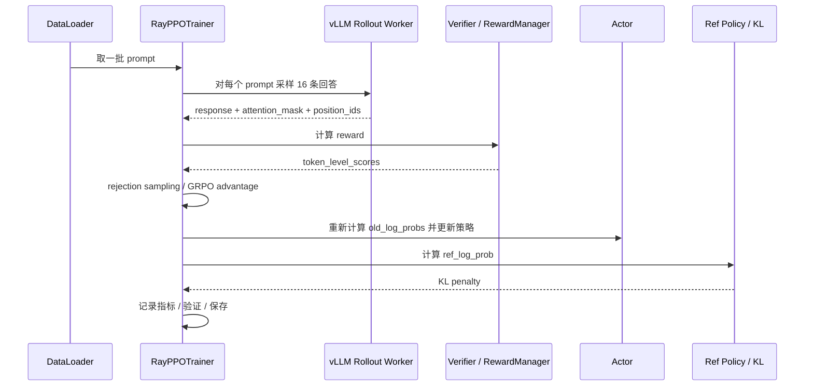
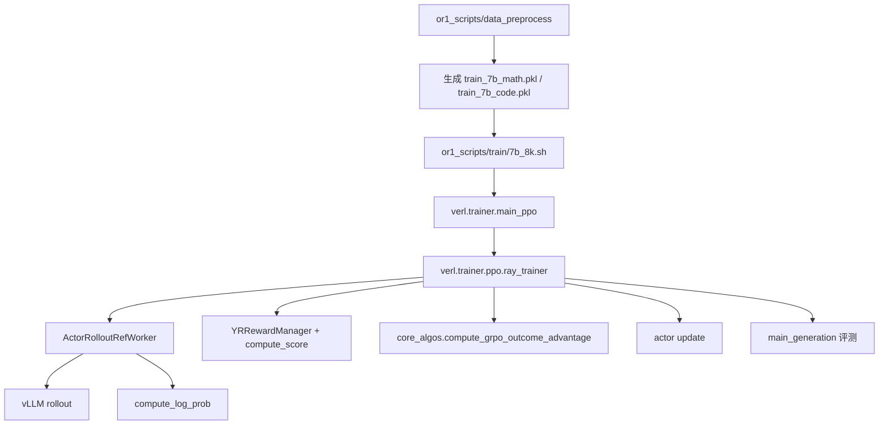

# Skywork-OR1 项目学习总纲

这份文档是主线手册，目标只有一个：让你把这个项目真正讲明白，能看懂、能复述、能回答面试官追问。

先给结论：

- 这个项目不是多模态项目，而是数学/代码推理大模型的后训练项目。
- 核心方法是 RLVR，或者说用可验证奖励做强化学习。
- 核心训练思路是 GRPO + 多阶段训练 + 自适应熵控制 + 高温采样 + 规则验证器。
- 核心工程是 Ray + FSDP + vLLM rollout + verifier sandbox。

---

## 1. 一句话讲清楚

Skywork-OR1 是在 DeepSeek-R1-Distill 系列长 CoT 模型上，利用数学题和代码题的可验证奖励继续做强化学习后训练，让模型在 AIME 和 LiveCodeBench 上更会推理、更稳定、更敢探索。

---

## 2. 总体流程图

```mermaid
flowchart LR
    A[官方 RL 数据集] --> B[难度过滤 + 去重 + 清洗]
    B --> C[训练集 pkl]
    C --> D[RLHFDataset 套 chat template]
    D --> E[vLLM rollout 采样 n 条回答]
    E --> F[Verifier 打分\n数学: math_verify\n代码: 单测 / sandbox]
    F --> G[GRPO 组内标准化 advantage]
    G --> H[PPO style policy update]
    H --> I[KL / entropy / rejection sampling]
    I --> J[验证 AIME / LiveCodeBench]
    J --> K[保存 checkpoint]
```



你可以把它记成 8 步：

```text
数据 -> 采样 -> 打分 -> 归一化 -> 更新 -> 约束 -> 验证 -> 保存
```

---

## 3. 单次训练步流程图



---

## 4. 你必须懂的数学原理

### 4.1 为什么不是普通监督学习

监督学习只告诉模型“标准答案是什么”，但不告诉它“哪种推理更好”。  
这个项目的关键是：模型自己生成多条解，再用 verifier 自动判断对错。

这类方法叫 RLVR:

```text
Reinforcement Learning with Verifiable Rewards
```

### 4.2 GRPO 是什么

GRPO 的核心是：

1. 对同一个 prompt 采样多条回答。
2. verifier 给每条回答一个 reward，通常是 0/1。
3. 在同一个 prompt 的组内做均值/标准差归一化。
4. 比平均好的回答，advantage 为正。
5. 比平均差的回答，advantage 为负。

公式可以记成：

```text
advantage = (reward - group_mean) / group_std
```

直觉：

- 同题下更好的回答，概率应该被提高。
- 更差的回答，概率应该被压低。
- 这样模型学的是“相对更好”的回答，而不是绝对分数。

### 4.3 为什么要多采样

因为 GRPO 依赖“组内比较”。  
如果同一题只采样 1 条，或者 16 条全对/全错，训练信号就很弱。

所以脚本里通常会设置：

```text
rollout.n = 16
```

这就是同一个 prompt 采样 16 条回答。

### 4.4 PPO clipping 是什么

PPO 不让策略一次走太远。  
它看的是新旧策略的概率比：

```text
ratio = exp(new_log_prob - old_log_prob)
```

如果 ratio 偏离 1 太多，就 clip 掉，避免更新过猛。  
你可以把它理解成“加了刹车的梯度上升”。

### 4.5 KL penalty 是什么

KL 惩罚是让当前策略别偏离参考模型太远。

```text
reward = verifier_score - beta * KL(current_policy, reference_policy)
```

作用：

- 保住基座模型的语言能力。
- 防止模型为了奖励学歪。

论文里也讨论过 `No KL Loss`，意思是某些阶段 KL 会把模型拉回去太多，影响提升。

### 4.6 熵和 entropy collapse

熵越高，模型越敢探索。  
熵越低，模型越确定，输出越来越像固定模板。

如果熵过早塌陷，模型会：

- 采样变单一。
- 探索不足。
- 最终测试性能变差。

所以 Skywork-OR1 加了自适应熵控制：

```text
当前熵 < 目标熵 -> 提高熵系数
当前熵 > 目标熵 -> 降低熵系数
```

### 4.7 Rejection sampling 是什么

如果同一 prompt 的 16 条回答全对或全错，那么这个 prompt 组几乎没有区分度。  
这类样本会被过滤掉，因为 GRPO 学不到有用的相对偏好。

你要记住一句话：

> 全对和全错的组，对 GRPO 来说都不够“有信息量”。

### 4.8 Pass@K 和 Avg@K

这两个是评测常用指标。

- `Pass@K`: K 次里面只要有一次对，就算通过。
- `Avg@K`: K 次平均正确率。

Skywork-OR1 论文里更强调 `Avg@K`，因为它更能反映模型在随机采样下的稳定性。

---

## 5. 代码逻辑图



### 5.1 数据准备

文件：

```text
or1_scripts/data_preprocess/download_and_filter_data_7b.py
```

作用：

- 从 Hugging Face 读取官方数据。
- 解析 `reward_model.ground_truth`。
- 根据 `extra_info.model_difficulty` 过滤样本。
- 拆成 math 和 code 两份 pkl。

你需要记住它的逻辑是：

```text
下载 -> 解析 -> 过滤 -> 拆分 -> 保存
```

### 5.2 训练入口

文件：

```text
or1_scripts/train/7b_8k.sh
verl/trainer/main_ppo.py
```

这两层分别做什么：

- bash 脚本负责给 Hydra 传参数。
- `main_ppo.py` 负责初始化 Ray、tokenizer、worker、reward manager。

### 5.3 主训练循环

文件：

```text
verl/trainer/ppo/ray_trainer.py
```

你可以把它理解成训练总控台，主线顺序是：

```text
采样回答
-> 算 reward
-> 过滤无效组
-> 算 old/ref logprob
-> 加 KL
-> 算 advantage
-> 更新 actor
-> 验证
-> 保存
```

### 5.4 奖励函数

文件：

```text
verl/workers/reward_manager/yr_code.py
verl/utils/reward_score/livecodebench/compute_score.py
```

它负责：

- 把模型输出 decode 成字符串。
- 提取最终答案或代码块。
- 数学题做 symbolic / string verify。
- 代码题跑单测或 sandbox。
- 最后把标量 reward 填到回答末尾 token。

### 5.5 生成与评测

文件：

```text
verl/workers/rollout/vllm_rollout/vllm_rollout.py
verl/trainer/main_generation.py
or1_scripts/eval/eval_7b.sh
```

核心思想：

- 训练时用 vLLM 快速采样。
- 评测时同一道题采样多次。
- 统计 avg@K / pass@K。

### 5.6 算法核心

文件：

```text
verl/trainer/ppo/core_algos.py
```

重点函数：

- `compute_grpo_outcome_advantage`
- `compute_policy_loss`
- `compute_entropy_loss`
- `kl_penalty`

---

## 6. 必须掌握的知识点清单

### 基础概念

- SFT: 监督微调。
- RLHF: 用人类偏好做强化学习。
- RLVR: 用可验证奖励做强化学习。
- PPO: 带 clip 的策略优化。
- GRPO: 组内相对优势优化，不依赖独立 critic。
- verifier: 自动判对错的函数或沙箱。
- rollout: 用当前策略生成回答。
- on-policy: 用当前策略自己采样再更新。
- off-policy: 用旧数据或重复使用过多数据更新。

### 工程概念

- Ray: 分布式任务调度。
- FSDP: 参数分片，省显存。
- vLLM: 高吞吐生成。
- offload: 把参数/梯度/优化器状态搬到 CPU。
- left padding: decoder-only 模型 batch 对齐方式。
- eos_mask: 只让有效 response token 参与 loss。
- uid / index: 标识同一个 prompt 的多条回答。

### 训练技巧

- 多阶段训练: 先短上下文，再长上下文。
- 高温采样: 提高探索。
- rejection sampling: 丢掉全对/全错组。
- adaptive entropy: 防止熵塌陷。
- no KL loss: 某些阶段减少对参考模型的束缚。

---

## 7. 模拟面试

下面这些题，建议你按“先看问题，再盖住答案自己说一遍”的方式练。

### 题 1：这个项目到底做什么？

**答：**  
它是一个推理大模型后训练项目。核心是把数学题和代码题交给 verifier 自动打分，再用强化学习提升模型的长链路推理能力。

### 题 2：为什么说它不是多模态项目？

**答：**  
因为它处理的是文本推理、数学和代码，没有图像、视频或音频输入。它更像多模态大模型岗位里常见的“后训练能力底座”。

### 题 3：RLVR 和 RLHF 有什么区别？

**答：**  
RLHF 依赖人类偏好，RLVR 依赖自动验证。这个项目里数学题看最终答案，代码题跑测试用例，所以 reward 更客观。

### 题 4：GRPO 为什么适合这个项目？

**答：**  
因为同一个题可以采样多条回答，组内能直接比较优劣，不一定非要训练 critic。这样更适合规则可验证任务。

### 题 5：为什么一个 prompt 要采样 16 条？

**答：**  
因为 GRPO 要做组内归一化，采样越多，组内比较越稳定。16 条是一个常见的折中，能提供足够的相对信号。

### 题 6：rejection sampling 为什么重要？

**答：**  
如果一个题所有回答都对或都错，这组数据对 GRPO 没啥区分度。过滤掉以后，训练更集中在“有难度、有差异”的题上。

### 题 7：entropy collapse 是什么？

**答：**  
就是模型越来越确定，输出越来越单一，探索能力下降。它会让后续训练越来越难，最终测试性能也容易变差。

### 题 8：怎么解决 entropy collapse？

**答：**  
Skywork 用了高温采样、on-policy、adaptive entropy control，有些阶段还减少 KL 约束。核心目标是让模型别太快变得“只会一种答案”。

### 题 9：KL penalty 有什么用？

**答：**  
它让当前策略别离参考模型太远。这样模型不会为了 reward 走偏，语言能力也更稳。

### 题 10：为什么论文里又说 No KL Loss？

**答：**  
因为 KL 太强会把模型拉回参考模型，影响继续变好。论文的意思不是永远不用 KL，而是某些阶段、某些设置下 KL 会阻碍提升。

### 题 11：vLLM 在这里干什么？

**答：**  
vLLM 负责高吞吐采样。因为训练时要对很多 prompt 生成很多条长回答，vLLM 比普通 generate 更适合。

### 题 12：reward 是怎么给的？

**答：**  
模型输出会被 decode 成字符串。数学题抽最终答案比对，代码题执行测试。正确就给 1，错误就给 0，或者给连续分数。

### 题 13：为什么奖励只放在最后一个 token 上？

**答：**  
因为这是 outcome reward，整段回答最终只看对错。把 reward 放在末尾 token 上，后面再扩展成 token-level advantage，最符合这种任务设定。

### 题 14：为什么要多阶段训练？

**答：**  
一开始就用很长上下文很费算力，而且容易学得慢。先用短上下文训练，等模型学稳了再拉长，效率更高。

### 题 15：Pass@K 和 Avg@K 有什么区别？

**答：**  
Pass@K 看 K 次里有没有一次对。Avg@K 看 K 次的平均正确率。Avg@K 更能反映模型在随机采样下的稳定性。

### 题 16：这个项目里 Ray、FSDP、vLLM 分别负责什么？

**答：**
- Ray 负责调度和并行任务。
- FSDP 负责训练侧的显存分片。
- vLLM 负责生成侧高吞吐采样。

### 题 17：你读代码时最先看哪里？

**答：**  
先看训练脚本 `or1_scripts/train/7b_8k.sh`，再看 `main_ppo.py`，然后看 `ray_trainer.py`。这三层把整个训练链路串起来了。

### 题 18：如果面试官问你“你学会了什么”？

**答：**  
我学会了怎么把可验证任务变成 RL 训练信号，怎么用 GRPO 做组内相对优化，怎么用 verifier、vLLM、Ray、FSDP 拼出一个可训练、可评测的后训练系统。

---

## 8. 代码对应表

| 主题 | 文件 | 你要会说的话 |
|---|---|---|
| 数据准备 | `or1_scripts/data_preprocess/download_and_filter_data_7b.py` | 官方数据下载后按模型难度过滤，拆成 math/code pkl |
| 训练入口 | `or1_scripts/train/7b_8k.sh` | 通过 Hydra 传参启动 GRPO 训练 |
| 总入口 | `verl/trainer/main_ppo.py` | 初始化 Ray、tokenizer、worker、reward manager |
| 主循环 | `verl/trainer/ppo/ray_trainer.py` | rollout -> reward -> KL -> advantage -> update |
| 核心算法 | `verl/trainer/ppo/core_algos.py` | GRPO / PPO / entropy / KL |
| 奖励管理 | `verl/workers/reward_manager/yr_code.py` | decode 后调用 verifier 并写回 reward tensor |
| 数学/代码 verifier | `verl/utils/reward_score/livecodebench/compute_score.py` | 数学答案比对、代码单测、sandbox 执行 |
| 数据集封装 | `verl/utils/dataset/rl_dataset.py` | chat template + left padding + 额外字段保留 |
| rollout | `verl/workers/rollout/vllm_rollout/vllm_rollout.py` | vLLM 多采样生成 |
| 评测 | `verl/trainer/main_generation.py` | n 次采样，算 avg@K / pass@K |
| 分布式 worker | `verl/workers/fsdp_workers.py` | actor / rollout / ref 三合一 worker |

---

## 9. 可以直接放进简历的版本

### 模板版

**任务背景**  
参与课题组 Skywork-OR1 推理大模型后训练项目，目标是通过可验证奖励强化数学和代码推理能力，并沉淀可复用的训练与评测链路。

**方法 / 实现**  
梳理并分析官方开源源码，理解数据难度过滤、verifier 奖励、GRPO 组内优势、PPO 更新、vLLM rollout、Ray + FSDP 分布式训练、adaptive entropy 和 rejection sampling 的完整流程，并补充中文注释与流程对照文档。

**实验结果 / 产出**  
形成可直接用于面试讲解的项目总纲、论文源码对照笔记和问答手册，能够清楚解释 Skywork-OR1 的训练机制、数学原理和工程实现。

### 精简版

- 参与 Skywork-OR1 推理大模型后训练项目的源码梳理与流程分析，掌握 RLVR、GRPO、verifier、vLLM rollout、Ray + FSDP 等核心技术。
- 整理项目流程图、核心原理和面试问答，沉淀可用于面试讲解的系统化知识材料。
- 将数学/代码 verifier、adaptive entropy、rejection sampling 等关键机制与源码实现逐一对齐，形成可复盘的项目理解。

---

## 10. 30 秒自我介绍版

> 我参与了课题组的 Skywork-OR1 推理大模型后训练项目，主要做的是源码梳理和流程理解。这个项目用数学和代码题的可验证奖励做 RL 训练，核心是 GRPO、vLLM rollout、Ray + FSDP 分布式训练、adaptive entropy 和 rejection sampling。我现在能把训练流程、数学原理和关键代码对应起来，并且能解释它为什么能提升长 CoT 推理能力。

---

## 11. 学习顺序

如果你想真正背下来，按这个顺序学：

1. 先看第 2、3 节的流程图。
2. 再看第 4 节的数学原理。
3. 然后看第 5 节的代码逻辑图。
4. 接着背第 6 节的知识点。
5. 最后刷第 7 节的模拟面试题。

---

## 12. 最后提醒

你真正需要掌握的，不是每一行代码，而是这条主线：

```text
可验证任务
-> 自动 reward
-> 组内相对优化
-> 稳定策略更新
-> 防止熵塌陷
-> 长 CoT 能力提升
```

这条线一旦能顺着说下来，这个项目就算真的吃透了。
